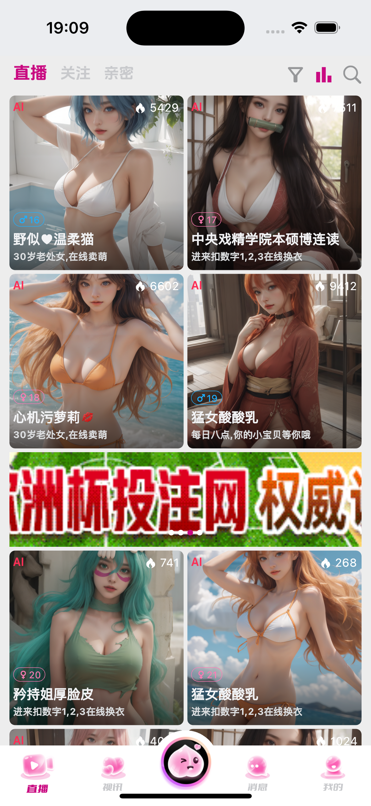
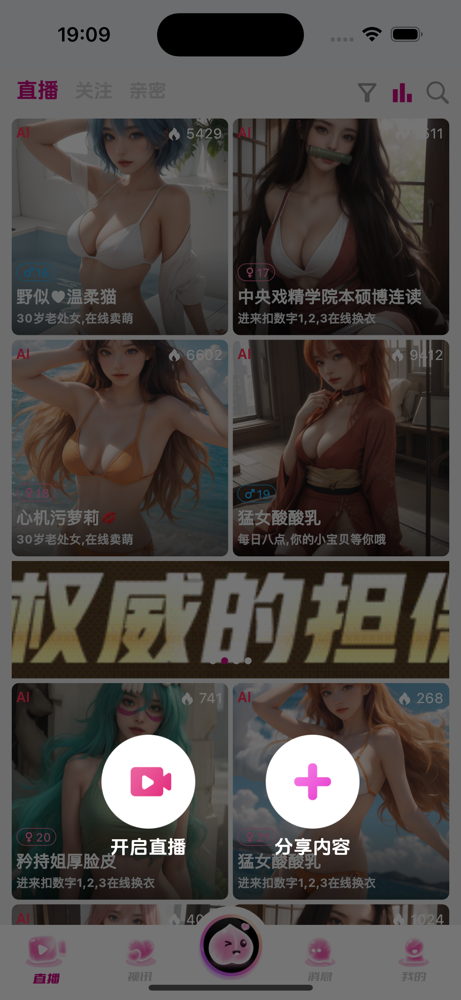
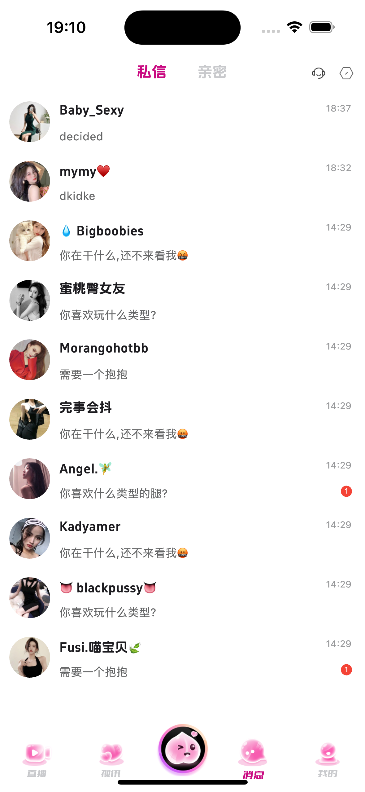

# WeLive 直播+IM聊天系统

## WeLive 是一款基于WeTalk的IM和音视频技术独立出来的直播+聊天系统,继承WeTalk高效IM结构,满足大规模聊天场景的同时增加直播推拉流功能
## 直播+IM 全自建,无需使用其他第三方sdk,满足数据安全的同时免除被第三方平台封控的风险
## 支持AI虚拟主播
## 如有三方需要,亦可无缝对接 其他直播sdk
## 如需直播美颜功能需由第三方美颜sdk收费
## H5,APP,PC端均可定制

## 
  
  
  
  
  
  
  

##
  
  
  
